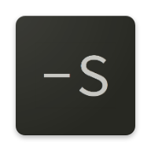

# sync-dl
<p>


</p>


> A tool for downloading and syncing remote playlists to your computer
- [INSTALLATION](#INSTALLATION)
- [ABOUT](#ABOUT)
- [USAGE](#USAGE)
- [EXAMPLE](#EXAMPLE)
- [DEVLOPMENT](#DEVLOPMENT)


# INSTALLATION
``` 
pip install sync-dl
```

# ABOUT
Created to avoid having music deleted but still have the convenience of browsing, adding and reordering new music using remote services such as youtube.

the application does not store any of its metadata in songs, metadata is stored next to them in a .metadata file, the music files are managed through numbering, allowing them to be played alphanumerically using any playback service (such as VLC)


# Usage
```
sync-dl [options] PLAYLIST
```
where playlist is simply the name of the directory you wish to store the playlist in. playlist directory will always be in current working directory unless a music directory is specified using the -l, --local-dir option to hard set a music directory.

To see all options use the command:
```
sync-dl -h
```

### Smart Sync:
The main feature of sync-dl
```
sync-dl -s PLAYLIST
```
Adds new music from remote playlist to local playlist, also takes ordering of remote playlist
without deleting songs no longer available in remote playlist.

songs that are no longer available in remote, will remain after the song they are currently after
in the local playlist


# EXAMPLE
```
sync-dl -l my/local/music/folder
```
Will use my/local/music/folder to store and manipulate playlist in the future.
```
sync-dl -n https://www.youtube.com/playlist?list=PL-lQgJ3eJ1HtLvM6xtxOY_1clTLov0qM3 sweetJams
```
Will create a new playlist at my/local/music/folder/sweetJams and
download the playlist at the provided url to it.

```
sync-dl -m 1 5 sweetJams
```
Will move song number 1 in the playlist to posistion 5
```
sync-dl -a sweetJams
```
Will check for any new songs in the remote playlist and append them to the end of sweetJams
```
sync-dl -s sweetJams
```
Will use smart sync on sweetJams, downloading new songs from the remote playlist and reordering the playlist to match the order of the remote playlist without deleting anysongs that are no longer avalible
```
sync-dl -p sweetJams
```
Will give you all the urls for the songs in sweetJams


# DEVLOPMENT
To build for devlopment run:
```
git clone https://github.com/PrinceOfPuppers/sync-dl.git

cd sync-dl

pip install -e .
```
This will build and install sync-dl in place, allowing you to work on the code without having to reinstall after changes

### Automated Testing
```
python test.py [options] TEST_PLAYLIST_URL
```
will run all unit and integration tests, for the integration tests it will use the playlist TEST_PLAYLIST_URL
